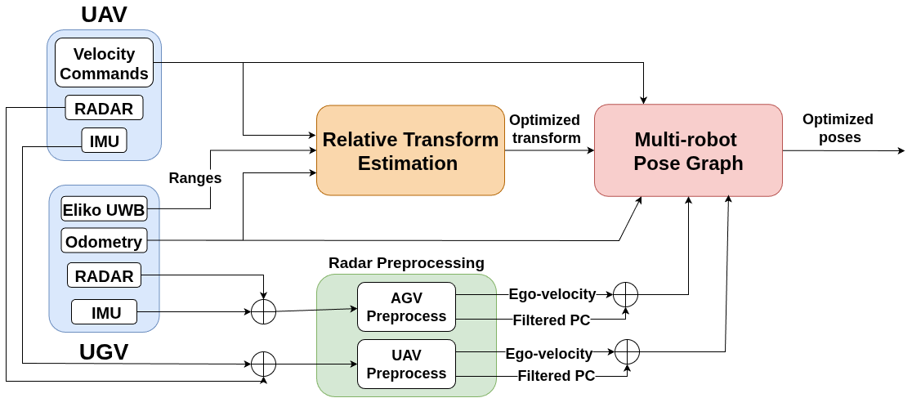
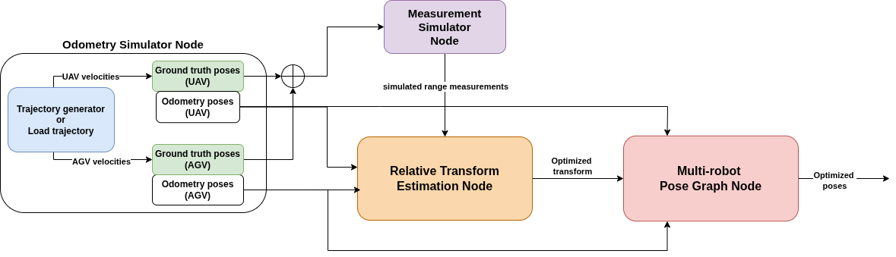

<h1 align="center"><a href="https://arxiv.org/abs/2509.26558" style="text-decoration:none;color:inherit;">Radio-based Multi-Robot Odometry and Relative Localization</a></h1>

<div align="center">
  <a href="https://www.youtube.com/watch?v=zTdIhjTZPeA"></a>
  <a href="https://arxiv.org/abs/2509.26558"></a>
  </a>
</div>

❗ **This work has been accepted to ICRA 2026!**

### Abstract
Radio-based methods such as Ultra-Wideband (UWB) and RAdio Detection And Ranging (RADAR), which have traditionally seen limited adoption in robotics, are experiencing a boost in popularity thanks to their robustness to harsh environmental conditions and cluttered environments. This work proposes a multi-robot UGV-UAV localization system that leverages the two technologies with inexpensive and readily-available sensors (Inertial Measurement Units, or IMUs, and wheel encoders) to estimate the relative position of an aerial robot with respect to a ground robot. The first stage of the system pipeline includes a nonlinear optimization framework to trilaterate the location of the aerial platform based on UWB range data, and a RADAR pre-processing module with loosely coupled ego-motion estimation which has been adapted for a multi-robot scenario. Then, the pre-processed RADAR data as well as the relative transformation are fed to a pose-graph optimization framework with odometry and inter-robot constraints. The system, implemented for the Robotic Operating System (ROS 2) with the Ceres optimizer, has been validated in Software-in-the-Loop (SITL) simulations and in a real-world dataset. The relative localization module outperforms state-of-the-art closed-form methods which are less robust to noise. Our SITL environment includes a custom Gazebo plugin for generating realistic UWB measurements modeled after real data.  Conveniently, the proposed factor graph formulation makes the system readily extensible to full Simultaneous Localization And Mapping (SLAM).  Finally, all the code and experimental data have been made publicly available to support reproducibility and to serve as a common open dataset for benchmarking.

## Basic Dependencies

* Ubuntu 22.04 LTS and ROS 2 [Humble](https://docs.ros.org/en/humble/index.html) or Ubuntu 24.04 LTS and ROS 2 [Jazzy](https://docs.ros.org/en/jazzy/index.html)
* [Ceres Solver](https://github.com/ceres-solver/ceres-solver)
* [Sophus](https://github.com/strasdat/Sophus)
* [pcl_ros](https://github.com/ros-perception/perception_pcl)
* [small_gicp](https://github.com/koide3/small_gicp)
* [eliko_ros](https://github.com/robotics-upo/eliko_ros)
* [ars548_ros](https://github.com/robotics-upo/ars548_ros)
* [4D-Radar-Odom](https://github.com/robotics-upo/4D-Radar-Odom/tree/arco-drone-integration) branch ```arco_drone_integration```.

Clone this repository along with the dependency packages to your ROS 2 workspace and compile with the standard ```colcon build``` command. Please follow the links above to the mentioned packages for specific setup instructions for each of them. 

**Note**: to use the SITL implementation of this package, we recommend setting up the simulation environment first and then setting up this package. Specific installation instructions for the SITL environment are found below.

## Additional Dependencies (for PX4 SITL only)

* [Gazebo Harmonic](https://gazebosim.org/docs/harmonic/ros_installation/).
* [QGC](https://docs.qgroundcontrol.com/master/en/qgc-user-guide/releases/daily_builds.html)
* [PX4 Toolchain](https://docs.px4.io/main/en/dev_setup/dev_env_linux_ubuntu.html)
* [tmux](https://github.com/tmux/tmux/wiki/Installing)

**Disclaimer**: the PX4 SITL simulation has been tested with ROS 2 Jazzy only, the rest of the implementation has been tested in both ROS 2 Humble and ROS 2 Jazzy.


## Main components

This repository contains two ROS2 packages:

* ```uwb_localization```: includes the UWB-based relative transformation estimation node and the pose-graph optimization node with radar constraints. The ```config``` folder in this package contains the parameter file for these two nodes.



* ```uwb_simulator```: includes the odometry simulation node and the measurement simulation node.  The ```config``` folder in this package contains the parameter file for these two nodes.



* ```uwb_gz_simulator```: includes the UWB plugin and modified UAV and UGV models to be inserted in PX4 SITL (see instructions below).  The ```px4_sim_offboard``` package contains the nodes that control the vehicles and parse telemetry to ROS standard messages compatible with the localization system.


## Launch files

```uwb_localization``` contains three launch files. To launch the real world dataset experiment (which includes radar odometry), type:
``` 
ros2 launch uwb_localization localization_dataset.launch.py
```
**Note**: You can find and download the real-world dataset as a .bag file in [Harvard Dataverse](https://dataverse.harvard.edu/dataset.xhtml?persistentId=doi:10.7910/DVN/KNKWMJ). The original dataset was recorded in ROS 2 Humble and as a consequence has the SQLite ``.db3`` format. If you are using ROS Jazzy, you may have to convert it first to the new standard ``.mcap`` format with [this tool](https://mcap.dev/guides/getting-started/ros-2). 

The second launcher ``localization.launch.py`` executes just the main system (without the radar odometry nodes) and is used in the SITL scenario which is launched as part of the tmux script ``simulator_launcher.sh``. 


The third and final launcher is a basic simulated scenario with just UWB and generic odometry (no SITL). To use it, type:
``` 
ros2 launch uwb_localization localization_sim.launch.py

```


## PX4 SITL Simulator

This package includes an enhanced simulator for relative localization which is integrated with [PX4](https://docs.px4.io/main/en/simulation/) Software In The Loop, which supports multi-vehicle simulation with Gazebo and ROS 2. We provide the following simulation tools:

* ```uwb_gz_simulation``` includes a ```models``` folder with modified versions the differential rover ```r1_rover``` and the ```x500``` UAV with UWB anchors and tags mounted onboard each respective platform, which act as drop-in replacements for the existing ones. Reference for the original models can be found [here](https://docs.px4.io/main/en/sim_gazebo_gz/vehicles.html). The folder ```uwb_gazebo_plugin``` contains a custom plugin that reports distances between each anchor and tag, which is meant to be included under the plugins directory of PX4-Autopilot. 

* ```px4_sim_offboard``` includes a set of nodes that interact with the simulator, allowing to obtain sensor readings and input commands to each of the vehicles. It includes a simple trajectory tracker for each of the robots. It also parses messages from ```px4_msgs``` format to standard ROS formats, for better integration with the optimizer. 

### Setup instructions (Ubuntu 24.04)

1) Install [ROS2](https://docs.ros.org/en/jazzy/index.html) Jazzy 

2) Install [Gazebo](https://gazebosim.org/docs/harmonic/ros_installation/) Harmonic.

3) Download [QGC](https://docs.qgroundcontrol.com/master/en/qgc-user-guide/releases/daily_builds.html) Daily Build.

4) Install the PX4 [Toolchain](https://docs.px4.io/main/en/dev_setup/dev_env_linux_ubuntu.html) for Ubuntu. 

5) Set up Micro [XRCE-DDS](https://docs.px4.io/main/en/ros2/user_guide.html#setup-micro-xrce-dds-agent-client) Agent & Client for PX4-ROS2 communication.

6) Build and source ROS2 [Workspace](https://docs.px4.io/main/en/ros2/user_guide.html#build-ros-2-workspace). To check that everything is working, we strongly encourage to also test the [multi-vehicle](https://docs.px4.io/main/en/sim_gazebo_gz/multi_vehicle_simulation.html) simulation example with ROS2 and Gazebo.

7) Copy the contents of the ```models``` folder in ```uwb_gz_simulation``` into ```/path/to/PX4-Autopilot/Tools/simulation/gz/models```

8) Add the custom plugin (steps taken from [template](https://github.com/PX4/PX4-Autopilot/tree/main/src/modules/simulation/gz_plugins/template_plugin) plugin instructions) 
    
    8.1: Copy the folder ```uwb_gazebo_plugin``` into ```/path/to/PX4-Autopilot/src/modules/simulation/gz_plugins```, and include the plugin for compilation by adding the following lines to the top-level ```CMakeLists.txt```. 

```cmake
    add_subdirectory(uwb_gazebo_plugin)
    add_custom_target(px4_gz_plugins ALL DEPENDS OpticalFlowSystem MovingPlatformController TemplatePlugin GenericMotorModelPlugin BuoyancySystemPlugin SpacecraftThrusterModelPlugin UWBGazeboPlugin)
```
    8.2: Then, load the plugin by including this line in `/path/to/PX4-Autopilot/src/modules/simulation/gz_bridge/server.config`.

```xml
<plugin entity_name="*" entity_type="world" filename="libUWBGazeboPlugin.so" name="custom::UWBGazeboSystem"/>
```

9) Build the code after adding the plugin: 
```
cd /path/to/PX4-Autopilot
make px4_sitl
```

10) Install [tmux](https://github.com/tmux/tmux/wiki/Installing) 

11) Add this package and its dependencies to your workspace.

12) Update ```simulator_launcher.sh``` with the paths to your ROS 2 workspace, your PX4-Autopilot installation folder and the location of the QGC executable. By default, the script assumes that PX4 and the ROS 2 ws are on the root folder, and QGC is in ```~/Desktop```. 

13) Give permissions to the simulator script and execute it: 

```
cd <ros2_ws>/mr-radio-localization
sudo chmod +x simulator_launcher.sh
./simulator_launcher.sh
```

Note that the simulator takes a while to load. After about 30 seconds, you should see the two robots start to move. 

# Run localization with recorded data

Both launch files ```localization.launch.py``` and ```localization_dataset.launch.py``` in the main package ```uwb_localization``` look for bag files with a name provided by the user in the ```bags/``` folder. The first launch file is intended to be used with simulated data, and the second launch file has some extra processing for real experiment data. 

# Troubleshooting

* At the moment, compilation of package ``uwb_localization`` may fail due to CMake not being able to find the ``Sophus`` library when it has been installed from package repositories (e.g ``vcpkg`` or ``apt``). To overcome this, please install ``Sophus`` from source following these steps, then compile the workspace again.
```
git clone https://github.com/strasdat/Sophus.git
cd Sophus
mkdir build && cd build
cmake ..
sudo make install
```

* Make sure you have set up the [ars_548](https://github.com/robotics-upo/ars548_ros) package following the instructions in the repo, particularly don't forget to install ``tclap`` which may cause compilation errors if it is not correctly set up.

```
sudo apt-get install libtclap-dev
```

* When using the SITL, if you have a common workspace with all dependencies listed in this repo, the first time you run ``colcon build`` it may fail due to CMake being unable to find ``px4_ros_com``. Please make sure you have first compiled and sourced the PX4 dependencies, then compile the rest of the packages:

```
cd <your_ws>
colcon build --packages-select px4_msgs px4_ros_com
source install/setup.bash
colcon build
source install/setup.bash
```

* In Ubuntu 24.04 LTS and ROS 2 Jazzy, there is a [previously reported issue](https://discuss.px4.io/t/dds-faild-to-connect-ros2-jazzy/47966/3) that prevents the MicroXRCE Agent from connecting to the PX4 topics. This is because, when building the Micro-XRCE-DDS Agent on Ubuntu 24.04 (ROS 2 Jazzy) as part of the SITL setup, there may be a conflict between the locally built libraries (FastDDS/FastCDR) and the ones provided by the ROS 2 Jazzy default installation (``opt/ros``). The more straightforward workaround would be to tell your shell to look at your local build folders before the ROS folders by placing your paths at the beginning of the ``LD_LIBRARY_PATH``. To do it, find exactly where your libraries are located (replace ``path`` with the directory where you have cloned Micro-XRCE-DDS-Agent).

```
find <path>/Micro-XRCE-DDS-Agent/build -name "libfastrtps.so*" | grep temp_install
find <path>/Micro-XRCE-DDS-Agent/build -name "libfastcdr.so*" | grep temp_install
```
Take note of the directories containing these files. They usually end in /lib. Then, add the following line to your ``.bashrc`` or ``.zshrc`` file using the paths you have found in the previous step, for example: 
```
export LD_LIBRARY_PATH=/home/YOUR_USER/Micro-XRCE-DDS-Agent/build/temp_install/fastrtps-2.14/lib:/home/YOUR_USER/Micro-XRCE-DDS-Agent/build/temp_install/fastcdr-2.2.0/lib:$LD_LIBRARY_PATH
```

Close the file and source it to apply the changes. After this, the agent should connect as expected and you should see the ROS 2 topics. 

**COMING SOON**: We are preparing docker images with a complete functional setup to avoid these issues, and they will be ready soon. Please stay put. 


# Acknowledgements

This work was supported by the grants PICRAH 4.0 0 (PLEC2023-010353): funded by the Spanish Ministry of Science and Innovation and the Spanish Research Agency (MCIN/AEI/10.13039/501100011033); and COBUILD (PID2024-161069OB-C31), funded by the Spanish Ministry of
Science, Innovation and Universities, the Spanish Research Agency (MICIU/AEI/10.13039/501100011033) and the European Regional Development Fund (FEDER, UE).


