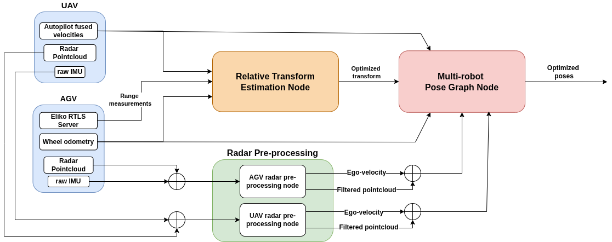

# mr-radio-localization

## Overview
This repository contains the developed code for the Master's Thesis "Radio-Based Multi-robot Odometry and Localization", the final project of the Master's Program in Robotics, Graphics and Computer Vision of University of Zaragoza.

### Abstract
Deployment of multi-robot teams in cooperative missions, like search and rescue, or exploration of large and dangerous environments (i.e. tunnels, mines, or rubble resulting from an accident), bring many unique challenges that are pushing research in exciting new ways. Particularly, localization is a crucial component which typically relies on cameras or LiDARs and underperforms in presence of poor lighting or dust in interiors, and adverse weather conditions in exteriors. In this context, radio-based methods such as Ultra-Wideband (UWB) and RADAR, which have been traditionally undersubscribed in robotics, are experiencing a boost in popularity thanks to their robustness to harsh environmental conditions and cluttered environments. Hence, this work proposes a multi-robot localization system that leverages the two technologies with inexpensive and readily-available sensors (IMU and wheel encoders) to estimate the position of a ground robot and an aerial robot with respect to a global reference frame, by using a pose-graph optimization framework with inter-robot constraints. The system has been developed for ROS2 using the Ceres optimizer, and has shown promising results in simulated conditions and on a real-world dataset. Furthermore, the standard factor graph formulation also makes it easily extensible to a full SLAM problem. 

## Dependencies

* [ROS2 Humble](https://docs.ros.org/en/humble/index.html)
* [Ceres Solver](https://github.com/ceres-solver/ceres-solver)
* [Sophus](https://github.com/strasdat/Sophus)
* [pcl_ros](https://github.com/ros-perception/perception_pcl)
* [small_gicp](https://github.com/koide3/small_gicp)
* [eliko_ros](https://github.com/robotics-upo/eliko_ros)
* [ars548_ros](https://github.com/robotics-upo/ars548_ros)
* [4D-Radar-Odom](https://github.com/robotics-upo/4D-Radar-Odom/tree/arco-drone-integration) branch ```arco_drone_integration```.

Clone this repository along with the dependency packages to your ROS 2 workspace and compile with the standard ```colcon build``` command.

## Main components

This repository contains two ROS2 packages:

* ```uwb_localization```: includes the UWB-based relative transformation estimation node and the pose-graph optimization node with radar constraints. The ```config``` folder in this package contains the parameter file for these two nodes.



* ```uwb_simulator```: includes the odometry simulation node and the measurement simulation node.  The ```config``` folder in this package contains the parameter file for these two nodes.


## Launch files

```uwb_localization``` contains two launch files. To launch the real world dataset experiment (which includes radar odometry), type:
``` 
ros2 launch uwb_localization localization.launch.py
```
**Note**: the real-world dataset has not yet been made public, but it will be made available soon. In the meantime, you can try the simulated version. 

To launch the simulated scenario with just UWB and generic odometry, type:
``` 
ros2 launch uwb_localization localization_sim.launch.py

```


